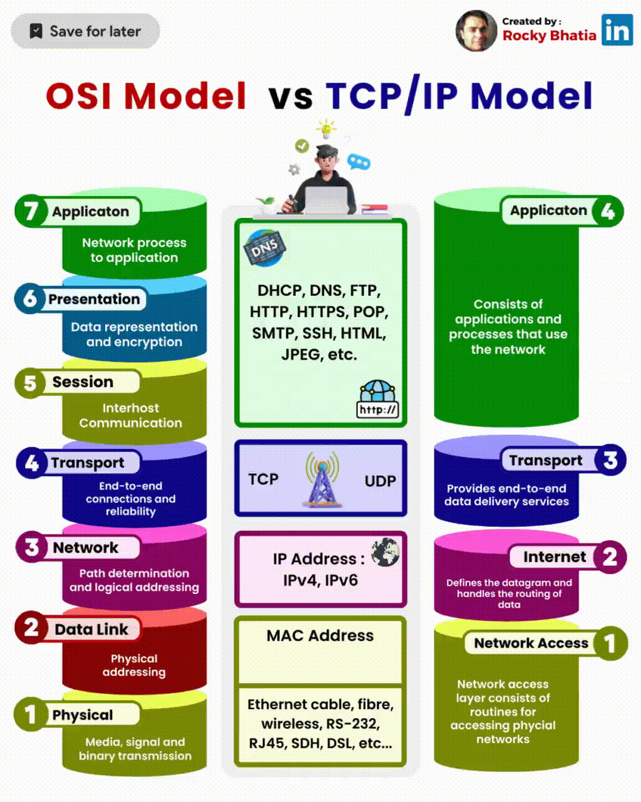
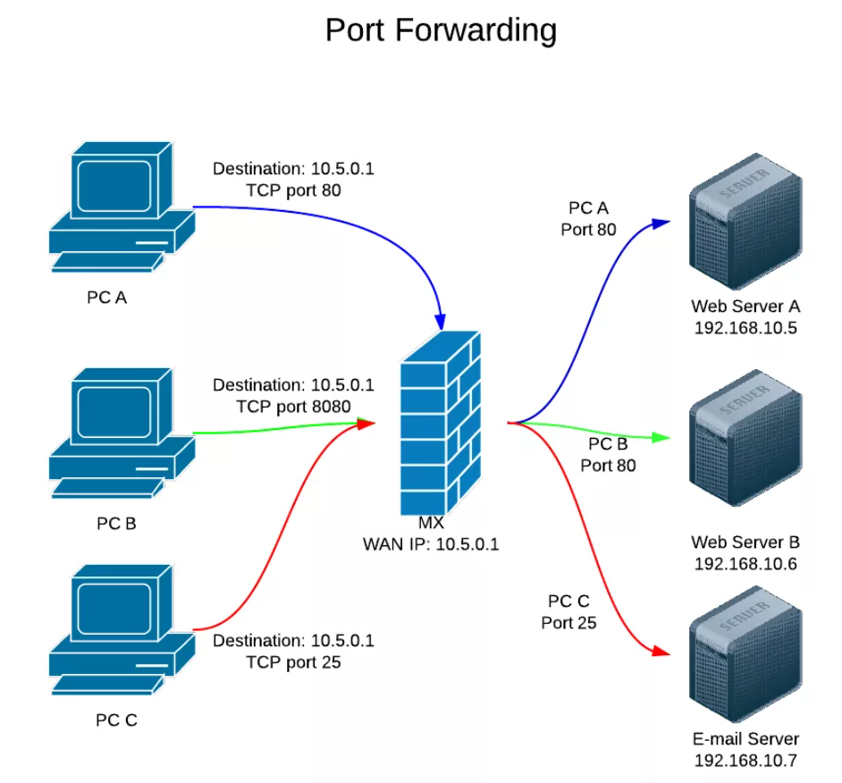
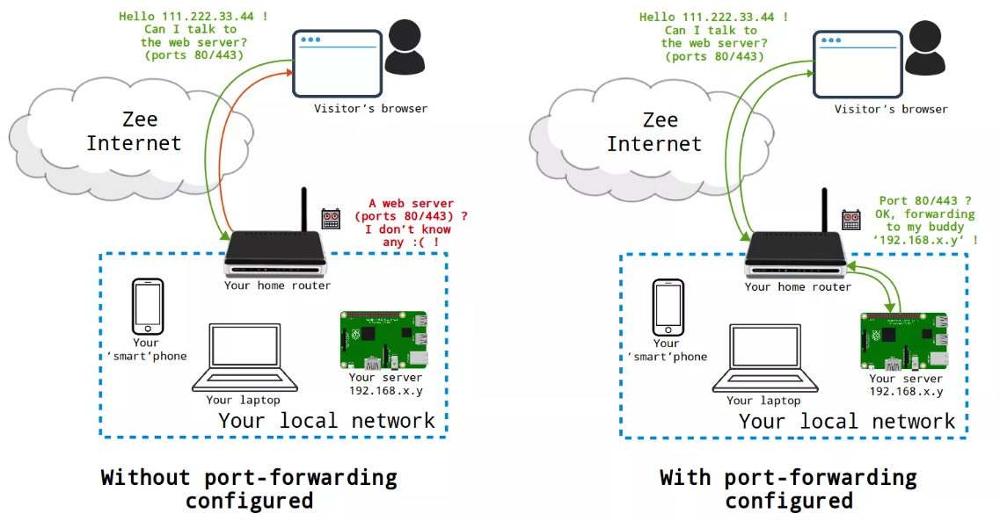
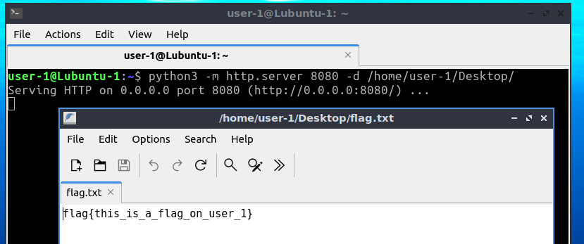
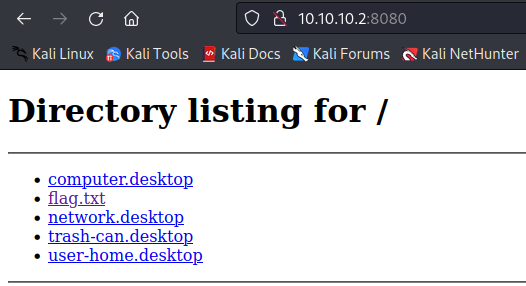
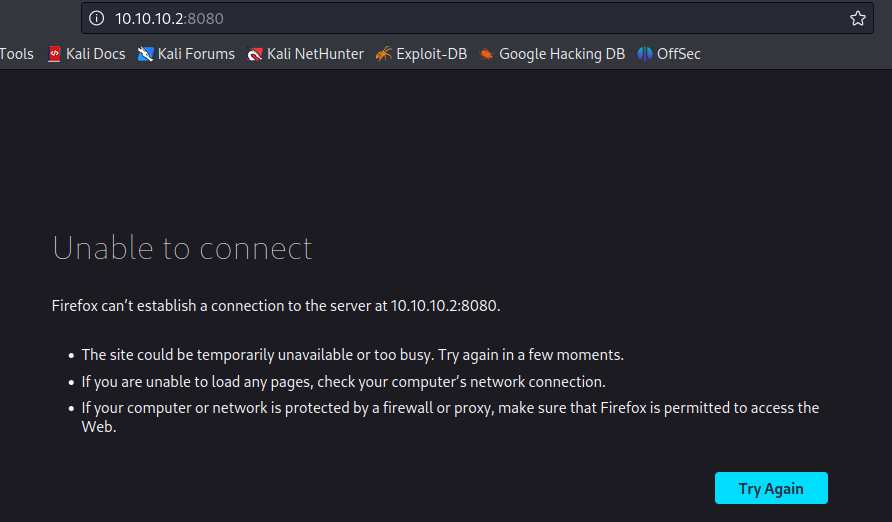
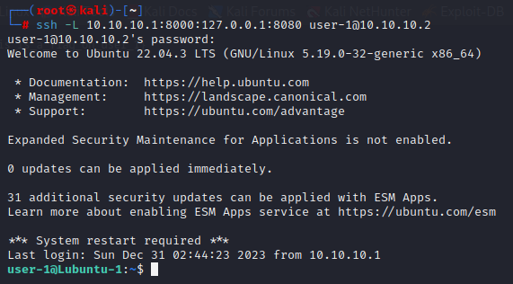
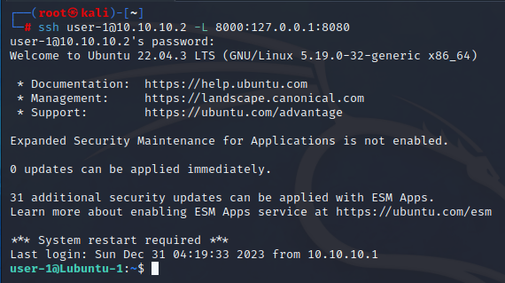

---
### Основы

Для понимания происходящего сначала разберем некоторый базис, который поможет нам закрепиться на теме и позволит в дальнейшем понять некоторые вещи, связанные с туннелированием.

#### Возвращаемся к истокам - модель OSI



Для чего нам на данный момент необходимо обратиться к модели OSI? Все просто, нам нужно разобраться, на каком уровне и каким образом функционируют порты, IP-адресация, SOCKS, SSH, а также ping.

Начнем с того, что ***IP-адресация появляется на 3 уровне модели OSI (L3 - Сетевой). По сути, ***IP-адрес*** – это идентификатор, позволяющий передавать информацию между устройствами в сети: он содержит информацию о местоположении устройства и обеспечивает его доступность для связи.

Понятие ***порт появляется уже на 4 уровне модели OSI (L4 - Транспортный)***. Основным предназначением сетевых портов является прием и передача данных определенного вида, а также устранение ошибки неоднозначности при попытке установить связь с хостом по IP-адресу, т.е. получается, что тут же прослеживается связь между службами, к которым можно так или иначе подключиться. Например, порт 80 и HTTP-служба.

Теперь более интересная вещь - ***ICMP (ping)***. **ICMP** - это протокол, разработанный специально для диагностических целей, а ping - это не что иное, как эхо-запрос ***ICMP*** и эхо-ответ, вот ***почему*** в ***ICMP*** нет понятия номеров ***портов***.

Мы не можем пинговать порты. Почему? Основываясь на вышеописанных фактах, можем сказать, что ICMP - это ***не транспортный протокол***, а часть протокола IP, который расположен на ***cетевом уровне (L3)*** модели OSI. Именно поэтому мы не можем пинговать порт.

***SOCKS*** — ***протокол сеансового уровня (L5***), который позволяет пересылать пакеты от клиента к серверу через прокси-сервер прозрачно (незаметно для них) и таким образом использовать сервисы за межсетевыми экранами (firewalls).

***SSH (Secure Shell)*** — это протокол ***прикладного уровня (L7)*** для возможности безопасного удаленного подключения, поэтому стоит учитывать несколько пунктов:
1. Не использовать эхо-запросы ICMP (ping) для тестирования SOCKS-прокси (вновь обращаем внимание на уровни модели OSI);
2. NMAP должен использоваться со сканированием ***по протоколу TCP (-sT)*** и ***без проверки ping (-Pn)***. Это также относится к сканированию версий (-sV) и сценариев (-sC). ***Их следует использовать в сочетании с -sT и -Pn***. Также в таком случае возможно использование ***proxychains***.
3. Использование команд/файлов/скриптов в связке с ***proxychains***.
4. Для удобства можно раскомментировать параметр ***"quite mode"*** в ***/etc/proxychains.conf***, чтобы при использовании команд не выводились сообщения об ошибках. Или же добавлять в конец команды при использовании proxychains запись вида ***2>/dev/null***

***Proxychains*** - это утилита, позволяющая вам соединяться с Интернетом через цепочку прокси-серверов. Это может быть полезно, если вы хотите скрыть свой IP-адрес или обойти ограничения, наложенные вашим интернет-провайдером. Proxychains работает, соединяясь с первым прокси-сервером в вашей цепочке, затем этот сервер соединяется со следующим прокси-сервером и так далее, пока запрос не достигнет конечного сервера, который отвечает на ваш запрос. Затем ответ проходит через ту же цепочку в обратном порядке, от конечного сервера к вашему компьютеру.

Собственно, возвращаясь к quite mode в proxychains. Ниже представлено влияние данного параметра на вывод отладочной информации:


Да, может показаться странным этот момент, но если сканируется, например, подсеть по маске в 24 бита, то отладочная информация будет засорять крайне сильно терминал.

#### Немного о Port Forwarding

***Port Forwarding (переадресация портов)*** - принимает трафик по заданному IP-адресу и порту и перенаправляет его на другой IP-адрес и порт. Уже сейчас может возникнуть множество вопросов, поэтому далее каждый отдельный способ реализации переадресации портов будет рассмотрен более детально, но в целом, данную концепцию можно представить в виде схемы:





Снова перечитайте определение выше и проследуйте за последовательностью действий на схемах. А мы начинаем углубляться в тему и рассматривать различные способы переадресации портов. 

---
### Часть 1. SSH Local Port Forwarding

***SSH Local Port Forwarding*** - это метод, который позволяет перенаправлять входящие соединения на удаленный сервер через SSH-туннель. Это полезно в ситуациях, когда нам нужно получить доступ к ресурсам, которые расположены за межсетевым экраном или маршрутизатором, или когда вы хотите обойти ограничения на доступ к определенным портам.

SSH Local Port Forwarding позволяет “пробросить” (перенаправить) порт нашего локального компьютера на определенный порт на удаленном сервере. Таким образом, можно получить доступ к ресурсу на удаленном сервере, как если бы он был доступен на нашем локальном компьютере.

Это достигается путем создания SSH-туннеля, который устанавливает безопасное соединение между нашим компьютером и удаленным сервером. Затем мы указываем, какой порт на нашем компьютере должен быть перенаправлен на определенный порт на удаленном сервере. Когда удаленный ресурс пытается установить соединение с нашим компьютером, соединение перенаправляется через SSH-туннель на удаленный сервер, где оно обрабатывается соответствующим образом.

#### Подготовка

Рассмотрим пример. Веб-сервер создается при помощи следующей команды:

```sh
python3 -m http.server 8080 -d /home/user-1/Desktop/
```

Также в директорию веб-сервера я положил текстовый файл с флагом для возможности дальнейшего тестирования. Тоже самое было сделано и для других хостов в рамках рассматриваемой сети:



> Обращаем внимание на то, что сервер открыт на 0.0.0.0, т.е. данные принимаются со всех входящих адресов


После открытия веб-сервера, он может быть доступен для ***Kali Linux***, получается, что относительно этого пользователя, мы можем прочитать флаг, который ***расположен в user-1***:




Естественно, на user-1 веб-сервер также доступен, но давайте ***поменяем адрес 0.0.0.0 на 127.0.0.1***:




#### Принцип работы SSH Local Port Forwarding

Получается, что ***внутри user-1 веб-сервер доступен, а на Kali Linux нет***. Попробуем достучаться до user-1 с Kali Linux, но для начала рассмотрим синтаксис команд для SSH Local Port Forwarding и схему для понимания работы:


На схеме смоделирована наша текущая ситуация. ***На Kali Linux мы хотим иметь доступ к внутреннему веб-серверу на user-1***. В начале должно происходить SSH-соединение между Kali Linux (10.10.10.1) и user-1 (10.10.10.2). Затем 10.10.10.2 открывает путь к 127.0.0.1:8080, тем самым, за таких два шага условных шага, на Kali Linux будет доступен веб-сервер. Команды для дальнейшей реализации примера:

```sh
$kali> ssh -L local_ip:local_port:remote_ip:remote_port remote_user@victim-IP

- ssh -L 10.10.10.1:8000:127.0.0.1:8080 user-1@10.10.10.2
- visit on kali: http://10.10.10.1:8000 (!not http://127.0.0.1:8000)
```

Применяем команду и смотрим на результат:




Иногда полную запись этой команды не делают, поэтому разбираемся, отличия есть:

```sh
$kali> ssh remote_user@victim-IP -L local_port:remote_ip:remote_port

- ssh user-1@10.10.10.2 -L 8000:127.0.0.1:8080
- visit on kali: http://127.0.0.1:8000 (!not http://10.10.10.2:8000)
```



По факту, результат измениться не должен, но это не совсем так. Смотрим и понимаем, что тот же самый адрес ***http://10.10.10.1:8000/flag.txt*** не позволяет произвести обращение к веб-серверу:


Но, стоит нам ***поменять 10.10.10.1 на 127.0.0.0.1***, как мы тут же снова видим удаленный веб-сервер, но уже у себя **на локальном порту 8000**:


Получение доступа к внутренним ресурсам другого хоста - это, конечно, хорошо, но можно сделать наш пример намного интереснее.

#### Продвижение через несколько хостов

Теперь представим ситуацию, что нам необходимо получить доступ к **user-3** из **Kali Linux**. Получается, нам необходимо сделать 3 проброса портов по тому же самому принципу, что и ранее в рассмотренном примере. Для полного понимания процесса обратимся к схеме:


1. Доступ к ***user-3*** мы хотим получить через порт ***5000***, значит, соединим этот порт с портом ***6000*** на ***user-1***, причем ***порт 6000 открывается относительно второго сетевого интерфейса (10.10.11.1) на user-1***. Таким образом, мы смогли соединить Kali Linux и user-1;
2. Далее соединим порт ***6000***, открытый ранее, с портом ***7000*** на ***user-2***, причем ***порт 7000 открывается относительно второго сетевого интерфейса (10.10.12.1) на user-2***;
3. Затем финальным шагом открываем порт ***8000***, на котором расположен веб-сервер, на хосте ***10.10.12.2*** и получаем доступ к веб-серверу через 2 хоста на Kali Linux по адресу http://10.10.10.1:5000

```sh
1. kali> ssh -L 10.10.10.1:5000:10.10.11.1:6000 user-1@10.10.10.2
	2. user-1> ssh -L 10.10.11.1:6000:10.10.12.1:7000 user-2@10.10.11.2
		3. user-2> ssh -L 10.10.12.1:7000:10.10.12.2:8000 user-3@10.10.12.2
			4. user-3>
```

> Замечу, что все эти команды вводятся из под каждого отдельного хоста, но при этом, это все выполняется через Kali, т.е. при создании SSH-туннеля, мы подключаемся к следующему хосту. Если мы из Kali подключились к user-1, значит, в этом созданном SSH-подключении делаем следующее подключение уже от user-1 до user-2, тем самым, мы получаем доступ до user-2 на Kali и так далее. Этот, можно сказать, вложенные SSH-соединения. 


---
### Часть 2. SSH Dynamic Port Forwarding

Динамическая переадресация портов (**SSH dynamic port forwarding**) позволяет осуществлять связь через ряд портов. Эта переадресация портов создается с использованием параметра a -D. Таким образом, SSH работает как прокси-сервер SOCKS.

Существует два типа протоколов SOCKS - SOCKS4 и SOCKS5. В основном это интернет-протоколы, которые маршрутизируют пакеты между сервером и клиентом с помощью прокси-сервера. SOCKS5 использует как TCP, так и UDP, в то время как SOCKS4 использует только TCP.

SOCKS-прокси - это простой SSH-туннель, в котором определенные приложения перенаправляют свой трафик через туннель на удаленный сервер, а затем прокси-сервер перенаправляет трафик в общий Интернет. В отличие от VPN, SOCKS-прокси необходимо настраивать для каждого приложения отдельно на клиентском компьютере.

Динамическая переадресация портов позволяет обрабатывать соединения с нескольких портов. Она анализирует трафик, чтобы определить адресата для данного соединения. Однако может потребоваться настроить программы для использования прокси-сервера SOCKS.

Пример создания динамической переадресации портов:

```bash
kali> ssh -D 127.0.0.1:9050 user@victim-IP
```

Пример SOCKS5:

```bash
kali> sudo nano /etc/proxychains4.conf

[ProxyList]
# add proxy here ...
# meanwile
# defaults set to "tor"
socks4 127.0.0.1 9050
```

---
### Часть 3. SSH Remote Port Forwarding

**SSH remote port forwarding (reverse tunneling)** — это метод, который используется, когда нужно разрешить внешний доступ к сервису или приложению, размещённому на локальной машине, обычно за брандмауэром или маршрутизатором.

---
### Часть 4. Double Pivoting

---
### Часть 5. SSHUTTLE

---
### Часть 6. Chisel


---
### Часть 7. Burpsuite as a Proxy

---
### Ссылки на материалы по теме

1. https://artkond.com/2017/03/23/pivoting-guide/#vpn-over-ssh
2. https://catharsis.net.au/blog/network-pivoting-and-tunneling-guide/
3. https://iximiuz.com/en/posts/ssh-tunnels/
4. https://wiki.merionet.ru/articles/pro-ssh-port-forwarding-v-linux/
5. https://en.wikipedia.org/wiki/Port_forwarding
6. https://www.ired.team/offensive-security-experiments/offensive-security-cheetsheets
7. https://dev.to/__namc/ssh-tunneling---local-remote--dynamic-34fa
8. https://github.com/t3l3machus/pentest-pivoting?tab=readme-ov-file#SSH-Dynamic-Port-Forwarding
9. https://linuxize.com/post/how-to-setup-ssh-tunneling/
10. https://csbygb.gitbook.io/pentips/post-exploitation/pivoting
